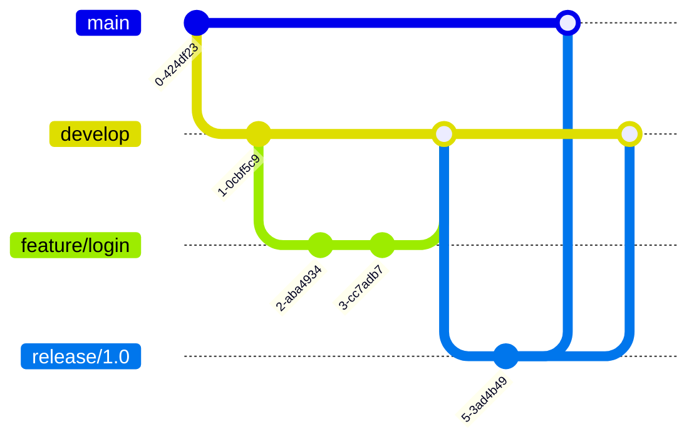

# Control de Versiones (GitFlow)

## Estructura de Branches

El proyecto utiliza el siguiente esquema de branches:

- **main:** Rama principal que contiene el código en producción
- **develop:** Rama de desarrollo principal donde se integran las nuevas características
- **feature/*:** Ramas para nuevas funcionalidades (ej: feature/login-system)
- **hotfix/*:** Ramas para correcciones urgentes en producción
- **release/*:** Ramas para preparar nuevas versiones

## Flujo de Trabajo Git

Se sigue el modelo GitFlow con las siguientes directrices:

1. Los desarrolladores crean feature branches desde develop
2. Al completar la funcionalidad, se crea un Pull Request hacia develop
3. Después de code review y testing, se mergea a develop
4. Para releases, se crea una rama release/* desde develop
5. Una vez probado, el release se mergea tanto a main como a develop

## Políticas de Merge

- Todo código debe pasar por Pull Request
- Se requiere al menos 1 aprobación para mergear
- Los tests automatizados deben pasar
- El código debe seguir los estándares definidos
- No se permiten merges directos a main

## Versionado Semántico

Se utiliza el formato MAJOR.MINOR.PATCH donde:

- **MAJOR (X.0.0):** Cambios incompatibles con versiones anteriores
- **MINOR (0.X.0):** Nuevas funcionalidades compatibles
- **PATCH (0.0.X):** Correcciones de bugs compatibles

<aside>
⚠️ Recuerda siempre seguir estas convenciones al trabajar en el repositorio. Para casos especiales, consultar con el líder técnico.

</aside>

