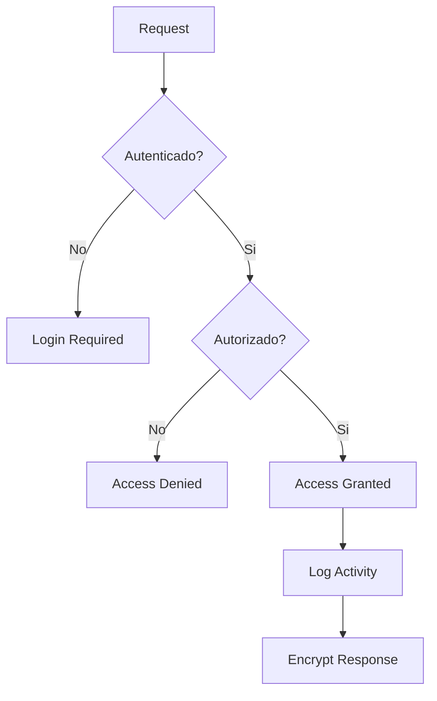

# Seguridad

### 1. Autenticación y Autorización

El sistema implementa un robusto sistema de autenticación y autorización basado en JWT (JSON Web Tokens) y roles de usuario.

- Proceso de Autenticación
    - Login mediante usuario y contraseña con validación de complejidad
    - Implementación de autenticación de dos factores (2FA)
    - Gestión de sesiones con tiempo de expiración configurable
    - Sistema de recuperación de contraseñas seguro
- Sistema de Autorización
    - Roles predefinidos: Admin, Manager, User, Guest
    - Permisos granulares basados en recursos
    - Control de acceso basado en roles (RBAC)
    - Registro de actividad por usuario

### 2. Encriptación de Datos

Implementación de múltiples capas de encriptación para garantizar la seguridad de los datos sensibles.

- Métodos de Encriptación
    - Encriptación AES-256 para datos en reposo
    - TLS 1.3 para comunicaciones en tránsito
    - Hash de contraseñas usando bcrypt
    - Gestión segura de claves de encriptación

### 3. Mejores Prácticas

- Políticas de Seguridad Implementadas
    - Protección contra ataques XSS y CSRF
    - Validación de entrada en todos los endpoints
    - Rate limiting para prevenir ataques de fuerza bruta
    - Headers de seguridad HTTP configurados
    - Sanitización de datos en entrada/salida

### 4. Auditoría de Seguridad

- Procesos de Auditoría
    - Logs detallados de acciones críticas
    - Sistema de alertas para actividades sospechosas
    - Monitoreo continuo de intentos de acceso
    - Reportes periódicos de seguridad

<aside>
🔒 Todas las implementaciones de seguridad deben ser revisadas y actualizadas regularmente según las nuevas amenazas y mejores prácticas de la industria.

</aside>

