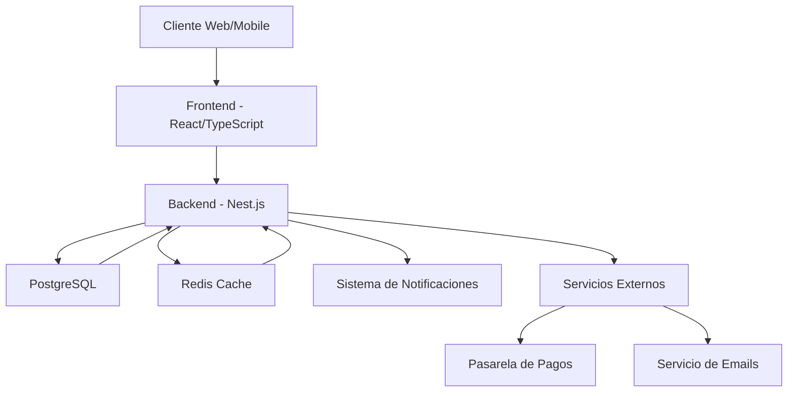

# Inicio

## Sobre el Proyecto

Turbostore es una plataforma de comercio electrónico dinámica inspirada en Tienda Nube, desarrollada como proyecto universitario. La plataforma permitirá a los usuarios crear y gestionar sus propias tiendas en línea de manera intuitiva y personalizable.

## Estructura del Proyecto

- **Página Inicial:** Información general del proyecto, equipo y stack tecnológico
- **Tablero Kanban:** Gestión ágil del proyecto con sprints de 2 semanas
- **Documentación:** Guías técnicas y documentación del desarrollo
- **Análisis:** Documento de requerimientos y análisis del proyecto

## Navegación

- [**📱 Página Inicial**](https://www.notion.so/Turbostore-Taller-lll-IFTS16-1bf0ec4380bd80bb9345fa4b78c2f424?pvs=21)
    
    - Descripción del proyecto
    
    - Integrantes del equipo
    
    - Stack tecnológico
    
    - Objetivos principales
    
- [**🛒**](https://emojipedia.org/es/carrito-de-la-compra) [Gestión del proyectos](https://www.notion.so/Gesti-n-de-Proyectos-1ca0ec4380bd80919660c5697869cf61?pvs=21)
    
    - Backlog del producto
    
    - 16 sprints planificados
    
    - Duración: 2 semanas por sprint
    
    - Total: 32 semanas de desarrollo
    
- [📚 **Documentación general**](https://www.notion.so/Documentaci-n-general-1bf0ec4380bd8038b569caca5dd7b8dd?pvs=21)
    
    - Especificaciones técnicas
    
    - Guías de desarrollo
    
    - APIs y servicios
    
    - Arquitectura del sistema
    
- 📋 [**Manual de Usuario**](https://www.notion.so/Manual-de-Usuario-1c00ec4380bd80f7b82acc8dc2f46c7f?pvs=21)
    
    - Requisitos funcionales
    
    - Requisitos no funcionales
    
    - Casos de uso
    
    - Análisis de viabilidad
    

## Repositorios de Github

[ui-turbostore-creator](https://github.com/feleiva297/ui-turbostore-creator)

[ui-turbostore-template](https://github.com/feleiva297/ui-turbostore-template)

[bff-turbostore](https://github.com/feleiva297/bff-turbostore)

## Stack Tecnológico Propuesto

| Stack | Tecnologías |
| --- | --- |
| Front End | Vite + React + Typescript |
| Back End | Nest.js |
| Database | Postgresql |
| ORM | Prisma |
| Cache/eventos/notificaciones | Redis |

## Integrantes del Equipo

| Integrante | Ocupación dentro del proyecto |
| --- | --- |
| Camila Soto | Desarrollador Frontend |
| Manuel Valenzuela | Desarrollador Frontend |
| Federico Leiva | Desarrollador Fullstack |
| Andrea Salazar | Desarrollador Backend |
| Brian Mamani | Desarrollador Backend |

## Diagrama de Arquitectura del Sistema:

Este diagrama muestra la arquitectura básica del sistema Turbostore, ilustrando la interacción entre los diferentes componentes tecnológicos.

[Gestión de Proyectos](https://www.notion.so/Gesti-n-de-Proyectos-1ca0ec4380bd80919660c5697869cf61?pvs=21)

[ Documentación general](https://www.notion.so/Documentaci-n-general-1bf0ec4380bd8038b569caca5dd7b8dd?pvs=21)

[Manual de Usuario](https://www.notion.so/Manual-de-Usuario-1c00ec4380bd80f7b82acc8dc2f46c7f?pvs=21)